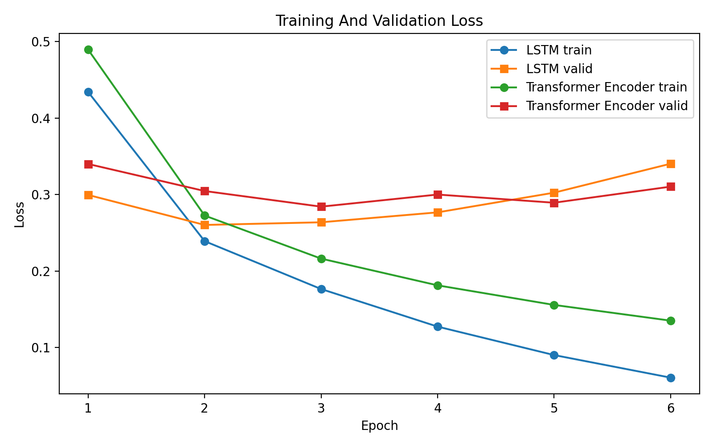
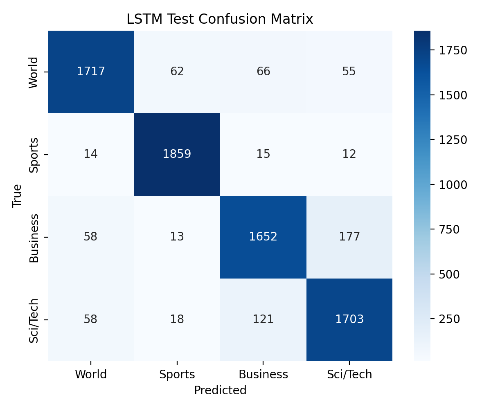
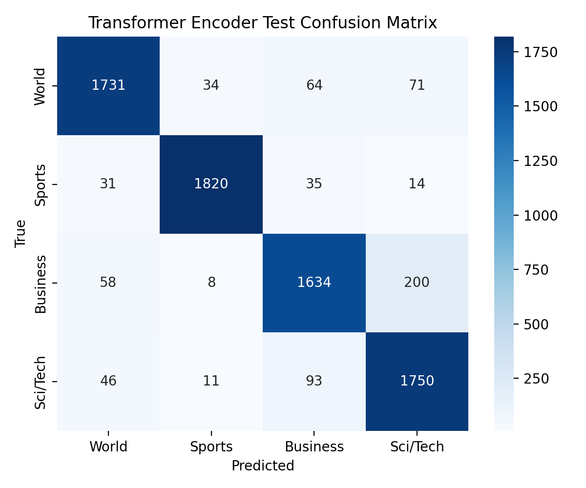

# LSTM vs Transformer Encoder for AG News Classification

## Table of Figures

Figure 1: Training and validation loss curves for the main comparison

Figure 2: LSTM final test confusion matrix

Figure 3: Transformer Encoder final test confusion matrix

Table 1: Dataset split sizes

Table 2: Class distribution by split

Table 3: Trainable parameter counts

Table 4: Final model configuration and hyperparameters

Table 5: Main validation and test results

Table 6: Dataset-size ablation results

Table 7: Optional sequence-length ablation results

Table 8: Selected misclassified examples

## Introduction

Text classification is one of the standard ways to evaluate whether a neural network can turn raw language into useful categories. In this report, I compare an LSTM classifier and a Transformer Encoder classifier on the same AG News task. The research question is: when dataset source, preprocessing, training budget, and metrics are controlled, does the recurrent LSTM or the self-attention Transformer Encoder give better classification performance, data efficiency, and error behavior?

The comparison is interesting because the two models represent different assumptions about sequence data. The LSTM reads the text recurrently and carries information through a hidden state. The Transformer Encoder uses self-attention, allowing every token to interact with other tokens directly. In theory, the Transformer should have more flexible global context modeling, while the LSTM may be more stable when the amount of data is reduced.

## Dataset

AG News is a four-class news classification dataset. Each input is a short news text, and the model predicts one of four categories: `World`, `Sports`, `Business`, or `Sci/Tech`. The project uses Hugging Face `fancyzhx/ag_news` as the only dataset source. The official training split was divided into 108,000 training examples and 12,000 validation examples using `train_test_split(test_size=0.1, seed=42)`. The official test split contains 7,600 examples and was reserved for final evaluation only.

| Split | Samples | Use |
| --- | --- | --- |
| Train | 108,000 | Vocabulary construction and model fitting |
| Validation | 12,000 | Model comparison, ablation evaluation, and interpretation |
| Test | 7,600 | Final evaluation only |

| Split | World | Sports | Business | Sci/Tech |
| --- | --- | --- | --- | --- |
| Train | 26,991 | 26,966 | 27,100 | 26,943 |
| Validation | 3,009 | 3,034 | 2,900 | 3,057 |
| Test | 1,900 | 1,900 | 1,900 | 1,900 |

Labels were verified as integer class indices `0, 1, 2, 3`, matching the requirement for `torch.nn.CrossEntropyLoss`. For preprocessing, the text was tokenized with a reproducible regular-expression tokenizer. The vocabulary was built only from the training split to avoid vocabulary leakage. The vocabulary size was capped at 20,000 tokens, with reserved indices for padding and unknown tokens. Tokens outside this train-built vocabulary map to `<unk>`, and the 20,000-token cap was kept fixed for both architectures and all main ablations. The main comparison used a maximum sequence length of 128 tokens. Both models received the same padded and truncated token IDs, and padding masks were used during LSTM pooling and Transformer attention.

## Models

The first model is a bidirectional LSTM classifier. It uses an embedding layer, a one-layer bidirectional LSTM, masked mean pooling, dropout, and a final linear classifier. The second model is a Transformer Encoder classifier. It uses an embedding layer, learned positional embeddings, two Transformer Encoder layers, four attention heads, feedforward dimension 512, masked mean pooling, dropout, and a final linear classifier. Both models were trained from scratch, without pretrained embeddings or pretrained language models.

| Model | Trainable parameters |
| --- | --- |
| LSTM | 2,825,220 |
| Transformer Encoder | 2,973,444 |

| Setting | LSTM | Transformer Encoder |
| --- | --- | --- |
| Vocabulary size | 20,000 | 20,000 |
| Embedding dimension | 128 | 128 |
| Encoder depth | 1 bidirectional LSTM layer | 2 Transformer Encoder layers |
| Hidden / feedforward size | Hidden size 128 per direction | Feedforward dimension 512 |
| Attention heads | Not applicable | 4 |
| Pooling strategy | Masked mean pooling | Masked mean pooling |
| Dropout | 0.2 | 0.2 |
| Optimizer / learning rate | Adam / 1e-3 | Adam / 1e-3 |
| Epochs / batch size | 6 / 64 | 6 / 64 |

The parameter counts are reasonably comparable for this assignment. The Transformer Encoder has about 5.2% more trainable parameters than the LSTM, so I treat its small final metric advantage cautiously. Most parameters in both models come from the shared embedding table: `20,000 × 128 = 2,560,000` embedding parameters, or about 90.6% of the LSTM and 86.1% of the Transformer Encoder. The non-embedding encoder and classifier components differ by about 148,224 parameters, so the total-size mismatch is modest but still worth acknowledging when interpreting small metric gaps.

## Experiments

The main comparison trained both models for 6 epochs using Adam, learning rate `1e-3`, batch size 64, dropout 0.2, seed 42, and CPU execution. The evaluation metrics were accuracy and macro F1-score. Macro F1 was included because AG News has multiple classes and the assignment requires class-sensitive evaluation, even though the dataset is nearly balanced.

The required ablation changed one major factor: the fraction of training data. The tested fractions were 25%, 50%, and 100% of the training split. The hypothesis was that the LSTM would be more stable with less data, while the Transformer Encoder would benefit more from the full dataset because self-attention has greater capacity. The 100% ablation run is not numerically identical to the main-comparison run because the ablation helper shuffles the selected training indices even when the selected fraction is 100%; this changes the minibatch order while keeping the same examples, seed, and hyperparameters.

An optional extension compared maximum sequence lengths of 128 and 256 tokens. This tested whether longer context improved validation performance enough to justify the additional training cost. The notebook also suppresses the PyTorch nested-tensor prototype warning so that final outputs focus on project-relevant results rather than a harmless implementation warning.

## Results

| Model | Split | Loss | Accuracy | Macro F1 |
| --- | --- | --- | --- | --- |
| LSTM | valid | 0.3402 | 0.9113 | 0.9108 |
| Transformer Encoder | valid | 0.3103 | 0.9118 | 0.9115 |
| LSTM | test | 0.3459 | 0.9120 | 0.9118 |
| Transformer Encoder | test | 0.3066 | 0.9125 | 0.9126 |

Both models reached similar final performance. On the official test split, the LSTM achieved 0.9120 accuracy and 0.9118 macro F1. The Transformer Encoder achieved 0.9125 accuracy and 0.9126 macro F1. The Transformer Encoder therefore performed slightly better on the final test metrics, but the difference is small and should not be overinterpreted as a decisive architectural win.

The epoch-1 validation results show a convergence-speed difference: the LSTM reached 0.8957 validation accuracy after one epoch, while the Transformer Encoder reached 0.8835. This suggests that the LSTM reached a usable validation accuracy faster in the first stage of training, even though the Transformer Encoder slightly surpassed it by the final test evaluation.

The loss curves show that both models continued to reduce training loss while validation loss stopped improving and then increased by the final epoch. This indicates overfitting by epoch 6. The LSTM had a sharper training-validation loss gap by the final epoch, while the Transformer Encoder retained slightly lower validation and test loss. A reasonable next experiment would tune early stopping or regularization using the validation set.

The confusion matrices show that Sports was the easiest class for both models. The largest recurring confusion was between Business and Sci/Tech. For the LSTM, 177 Business items were predicted as Sci/Tech and 121 Sci/Tech items were predicted as Business. For the Transformer Encoder, 200 Business items were predicted as Sci/Tech and 93 Sci/Tech items were predicted as Business. This directional asymmetry suggests that the Transformer Encoder more aggressively predicts Sci/Tech for business stories with technology-company surface terms, while the LSTM more often maps Sci/Tech stories back toward Business.

Figures used for the final report:

## Ablation Study

Hypothesis: the LSTM will be more stable with limited training data, while the Transformer Encoder will benefit more from the full dataset. The changed variable was training-set fraction. The controlled variables were dataset source, train/validation split, tokenizer, vocabulary, maximum sequence length, optimizer, learning rate, batch size, epoch count, metrics, and validation evaluation.

| Model | Training fraction | Validation accuracy | Validation macro F1 | Accuracy gain vs 25% |
| --- | --- | --- | --- | --- |
| LSTM | 25% | 0.8719 | 0.8713 | +0.00 pp |
| Transformer Encoder | 25% | 0.8699 | 0.8696 | +0.00 pp |
| LSTM | 50% | 0.8944 | 0.8940 | +2.25 pp |
| Transformer Encoder | 50% | 0.8901 | 0.8895 | +2.02 pp |
| LSTM | 100% | 0.9089 | 0.9082 | +3.70 pp |
| Transformer Encoder | 100% | 0.9146 | 0.9142 | +4.47 pp |

The ablation supports the hypothesis. At 25% training data, the LSTM slightly outperformed the Transformer Encoder. At 50%, the LSTM again had higher validation accuracy and macro F1. At 100%, the Transformer Encoder moved ahead. Quantitatively, the LSTM gained about +3.70 percentage points from 25% to 100% training data, while the Transformer Encoder gained about +4.47 percentage points. This provides numerical evidence that the Transformer Encoder benefited more from access to the full training split, while the LSTM was more data-efficient in lower-data settings.

The optional sequence-length ablation is shown below.

| Model | Max length | Validation loss | Validation accuracy | Validation macro F1 |
| --- | --- | --- | --- | --- |
| LSTM | 128 | 0.3402 | 0.9113 | 0.9108 |
| Transformer Encoder | 128 | 0.3103 | 0.9118 | 0.9115 |
| LSTM | 256 | 0.3535 | 0.9065 | 0.9058 |
| Transformer Encoder | 256 | 0.3304 | 0.9062 | 0.9059 |

Increasing maximum sequence length from 128 to 256 did not improve validation performance. Both models performed worse at 256 tokens. Under the current training budget and architecture sizes, longer context added cost without improving classification quality.

## Failure Analysis

The table below gives six representative misclassified test examples. It includes cases missed by both models, cases missed only by the LSTM, and cases missed only by the Transformer Encoder.

| # | Input excerpt | True label | LSTM prediction | Transformer prediction | LSTM conf. | Transformer conf. | Truncation note | Likely reason |
| --- | --- | --- | --- | --- | --- | --- | --- | --- |
| 1 | Live: Olympics day four Richard Faulds and Stephen Parry are going for gold for Great Britain... | World | Sports | Sports | 0.9369 | 0.9983 | Possible; long live-report format may exceed 128 tokens. | Sports terms dominate the short text even though the dataset section is World. |
| 2 | Intel to delay product aimed for high-definition TVs SAN FRANCISCO -- In the latest of a seri... | Business | Sci/Tech | Sci/Tech | 0.9941 | 0.9977 | Unlikely; company and product cues appear early. | A technology company story overlaps Business and Sci/Tech vocabulary. |
| 3 | Prediction Unit Helps Forecast Wildfires (AP) AP - It's barely dawn when Mike Fitzpatrick sta... | Sci/Tech | World | Sci/Tech | 0.4821 | 0.9785 | Unlikely; wildfire/prediction cues appear early. | Weather prediction language mixes science terms with world-event framing. |
| 4 | Some People Not Eligible to Get in on Google IPO Google has billed its IPO as a way for every... | Sci/Tech | Business | Sci/Tech | 0.8170 | 0.8252 | Unlikely; IPO cues appear early. | Finance and technology cues conflict; the IPO framing points toward Business. |
| 5 | Teenage T. rex's monster growth Tyrannosaurus rex achieved its massive size due to an enormou... | Sci/Tech | Sci/Tech | Business | 0.4429 | 0.5615 | No; short item fits within the limit. | Very short science item gives limited context; the Transformer overweights business-like wording. |
| 6 | IBM to hire even more new workers By the end of the year, the computing giant plans to have i... | Sci/Tech | Sci/Tech | Business | 0.8355 | 0.6214 | Unlikely; hiring/company cues appear early. | Company hiring story overlaps labor/business cues and computing-company Sci/Tech label. |

The selected errors show that the two models often fail on semantic boundary cases. Some examples contain surface words strongly associated with a different news section, such as an Olympics item labeled World but predicted as Sports by both models; this is also the example where truncation is most plausible because live-report text can exceed the 128-token limit. Other examples involve technology companies or IPOs, where Business and Sci/Tech labels overlap and the main disambiguating cues appear early enough that truncation is unlikely to be the primary cause. Example 3 is also informative for calibration: the LSTM's incorrect World prediction has only 0.4821 confidence, which makes it a borderline error rather than a strong commitment, while the Transformer Encoder is highly confident in the correct Sci/Tech label at 0.9785. Overall, the models fail similarly when the text has ambiguous section cues, but they also show different single-model errors: the LSTM misread some science/world-style items, while the Transformer misread some short Sci/Tech items as Business.

## Conclusion

Both from-scratch models performed well on AG News under the controlled setup, reaching about 91.2% final test accuracy. The Transformer Encoder achieved the best final test metrics, but only by a small margin. The LSTM converged faster in the first epoch and was stronger in lower-data ablation settings, while the Transformer Encoder benefited more from the full training set.

The required dataset-size ablation supports the original data-efficiency hypothesis. The optional sequence-length ablation showed that simply increasing maximum sequence length from 128 to 256 did not improve validation metrics. The most reasonable next experiment would be to tune early stopping or regularization, because both models show overfitting by the final epoch. A further limitation is that the ablations were run with a single seed; repeating the comparison across multiple seeds would make the data-efficiency conclusion more statistically robust.

## AI Usage Appendix

The complete notebook and generated output files are included in the project repository. The AI Usage Appendix is provided as a separate required appendix and also included in the combined report deliverable.

## References

AG News dataset via Hugging Face `fancyzhx/ag_news`.

PyTorch documentation for recurrent layers, Transformer Encoder layers, and `torch.nn.CrossEntropyLoss`.
